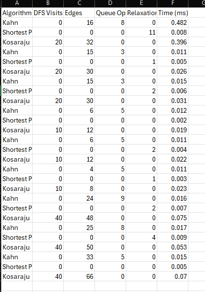

# Project: collection of algorithm implementations for the "Design and Analysis of Algorithms" assignment

## Overview
This project is a Java program that works with graphs. It implements algorithms for graph analysis and collects their data using metrics. The project can read graph data from JSON files and export the results in both CSV and JSON formats.

## Project Structure

Package <strong>algs</strong>

<h2>Util</h2>
<ul>
    <li><strong>Edge</strong> - class for weighted edges (fields: <code>to</code> and <code>weight</code>).</li>
    <li><strong>DFS1</strong> and <strong>DFS2</strong> - Depth-First Search algorithms; count visited vertices and edges for metrics.</li>
    <li><strong>reverseGraph</strong> - reverses a directed graph.</li>
    <li><strong>readJsonWeighted</strong> - reads a weighted graph from JSON.</li>
    <li><strong>readJson</strong> - reads an unweighted graph from JSON.</li>
</ul>

<h2>Metrics</h2>
<ul>
    <li>Counts <strong>DFS visits</strong>, <strong>edges processed</strong>, <strong>queue operations</strong>, and <strong>relaxations</strong>.</li>
    <li>Gets time in milliseconds.</li>
    <li>Provides methods: <code>reset()</code>, <code>startTimer()</code>, <code>stopTimer()</code>, <code>getValues()</code>, <code>getHeader()</code>.</li>
</ul>

<h2>MetricsExport</h2>
<ul>
    <li>Writes metrics to a CSV file.</li>
    <li>Records metrics for each algorithm.</li>
</ul>

<h2>Kahn</h2>
<ul>
    <li>Implements Kahn's algorithm for topological sorting of a DAG.</li>
    <li>Uses a queue for vertices with zero in-degree.</li>
    <li>Updates metrics for queue operations and processed edges.</li>
</ul>

<h2>ShortestPath</h2>
<ul>
    <li>Computes shortest and longest paths in a weighted DAG.</li>
    <li><strong>shortestPath</strong> - calculates shortest distances using relaxation.</li>
    <li><strong>LongestPath</strong> - calculates longest distances using relaxation.</li>
    <li><strong>computeEverything</strong> - returns both shortest and longest paths in a <code>ResultFromSP</code> object.</li>
</ul>

<h2>Kosaraju</h2>
<ul>
    <li>Finds strongly connected components (SCCs) using Kosaraju's algorithm.</li>
    <li>Performs two DFS traversals: one on the original graph, one on the reversed graph.</li>
    <li>Counts DFS visits and processed edges for metrics.</li>
</ul>

<h2>TestAlgs</h2>
<ul>
    <li>Reads graph JSON files of different sizes (small, medium, large).</li>
    <li>Runs Kahn, ShortestPath, and Kosaraju algorithms.</li>
    <li>Exports results to CSV and JSON output files.</li>
</ul>

<h2>Algorithms Overview</h2>
<ul>
    <li><strong>Kahn’s Algorithm (Topological Sort)</strong> - Finds topological order of a DAG using a queue for vertices with zero in-degree.</li>
    <li><strong>Shortest and Longest Paths</strong> - Works only on DAGs; uses topological order and relaxation to compute distances.</li>
    <li><strong>Kosaraju’s Algorithm (SCC)</strong> - Finds strongly connected components with two DFS passes (original and reversed graph).</li>
</ul>

<h2>Test Results</h2>
